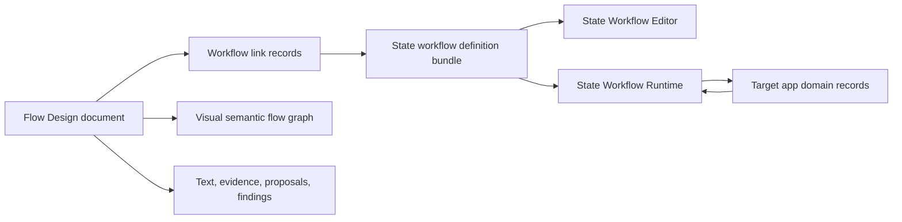

# Flow Design And State Workflow Definitions

## Purpose

Flow Design and state-workflow definitions are both ways to make an app understandable enough to build and maintain. They should not be treated as competing sources of truth.

Flow Design is the visual design and explanation layer. It helps a user or Codex describe an app, feature, module, failure path, maintenance risk, or implementation plan as a semantic flowchart with linked prose, source evidence, validation findings, proposals, and exportable implementation notes.

State-workflow definitions are the executable lifecycle contract layer. They describe valid durable states, legal transitions, user and automatic actions, visibility metadata, buckets, lifecycle hooks, schedules, and handler metadata that a target app or runtime can import and enforce.

The common goal is to move from intent to implementation without losing traceability. Flow Design should explain and review the broader system. State-workflow definitions should govern the durable stateful parts that need precise transition enforcement.

## Short Version

Use Flow Design to answer:

- What does this app, feature, or module do?
- What are the major user and system paths?
- Where are the decision points, error paths, retries, source links, and implementation risks?
- What should Codex or a developer build next?
- What changed after a source rescan or proposal?

Use state-workflow definitions to answer:

- What states can a durable work item be in?
- Which state transitions are legal?
- Which named actions perform those transitions?
- Which actions are visible user actions versus automatic/internal actions?
- Which hooks, guards, handlers, schedules, and retries must a runtime or target app support?
- What workflow contract can be imported, activated, tested, and enforced?

Use them together when a Flow Design diagram identifies a durable lifecycle that should become enforceable app behavior.

## How They Complement Each Other

### Flow Design Provides Context Around A Workflow

A state-workflow definition can say that `queued` may transition to `running`, `failed`, or `cancelled`, but it does not explain the full app experience around that lifecycle. Flow Design can show:

- the user journey that creates or encounters the work item
- the UI surfaces where actions appear
- the source files, modules, and commands related to the workflow
- failure paths that should be reviewed before implementation
- acceptance criteria and notes attached to each step
- Codex proposals and design review findings before mutation
- exportable Markdown for implementation briefs and handoff docs

The state-workflow definition can then capture the durable lifecycle subset of that broader design.

### State-Workflow Definitions Add Precision To Flow Design

Flow Design can show a process visually, but a normal flowchart can be ambiguous about whether a node is just explanatory or whether it defines durable app behavior. State-workflow definitions add precise contract semantics:

- states are known identifiers
- entry and terminal states are explicit
- transitions are validated
- actions have stable IDs, labels, trigger types, and visibility
- automatic actions are separated from user actions
- lifecycle hooks and schedules are explicit metadata
- runtime integration has clear host-app responsibilities

Flow Design can reference or embed this precision where a diagram represents an actual lifecycle rather than a loose process description.

### Flow Design Can Author Or Review Candidate Workflows

Flow Design can act as a visual planning surface before a strict workflow bundle exists. A user may sketch a queue, review, approval, retry, or publishing flow, then ask Codex to propose a state-workflow definition from the selected flow objects.

That proposal should remain reviewable in Flow Design. It should validate against the Flow Design semantic model first, then validate against the state-workflow definition schema before export or handoff.

### State-Workflow Definitions Can Feed Back Into Flow Design

An existing state-workflow definition bundle can be imported into Flow Design as a source artifact. Flow Design can render it as a lifecycle diagram, attach prose and source evidence, show which UI surfaces expose each action, and identify missing failure paths, unclear labels, hidden transitions, or implementation risks.

This makes the workflow contract explainable to humans without weakening its role as a runtime contract.

## How They Might Clash

### Competing Sources Of Truth

The most serious clash is treating both artifacts as authoritative over the same thing.

Flow Design should be authoritative for visual explanation, semantic diagrams, text sections, source links, proposals, review findings, and document lifecycle state. State-workflow definitions should be authoritative for executable workflow states, transitions, actions, hooks, and workflow metadata.

If Flow Design directly edits runtime state semantics without producing a validated workflow-definition proposal, or if a workflow bundle tries to store broad visual design context, the boundary becomes unclear.

### Visual Flowchart Semantics Versus Lifecycle Semantics

Not every process box is a durable state. Not every arrow is a legal transition. Not every decision diamond is a runtime guard. Not every retry loop is a scheduled lifecycle hook.

Flow Design can represent navigation, data flow, user decisions, implementation steps, source dependencies, and AI proposal review. State-workflow definitions should represent durable item lifecycle behavior only. Forcing every visual path into a state machine would over-model the app and make implementation brittle.

### Different ID And Naming Rules

Flow Design needs stable document IDs for views, objects, connections, text sections, proposals, snapshots, and provenance records. State-workflow definitions use stricter app-facing identifiers for state IDs, action IDs, bucket IDs, handler keys, and definition versions.

If Flow Design labels become workflow IDs automatically, user-facing prose can leak into runtime contracts. If workflow IDs become the only labels shown in Flow Design, the visual tool becomes less useful for design.

The integration needs explicit mapping fields rather than implicit name matching.

### Reviewable Proposals Versus Direct Mutation

Flow Design requires Codex-generated changes to become reviewable proposals before they mutate a document. State Workflow Runtime requires durable workflow transitions to go through runtime APIs such as allowed-action computation and action execution.

A bad integration could bypass both:

- AI output writes directly to a Flow Design document.
- A Flow Design diagram edit writes directly to an activated runtime workflow.
- A runtime transition is simulated by moving a visual node or changing a document lifecycle label.

The correct integration keeps proposal application and runtime execution separate.

### Version And Compatibility Drift

State-workflow definitions have strict numbered schema and definition versions. Flow Design documents will also need semantic schema versions and document revisions.

Clashes happen if:

- Flow Design exports stale workflow bundles after a diagram edit.
- A workflow bundle changes but the visual diagram still describes the old contract.
- compatibility imports normalize a workflow bundle but Flow Design preserves outdated visual assumptions.
- Codex proposes a diagram change that conflicts with an active workflow definition version.

The integration needs explicit version links, validation status, and stale-reference detection.

### Presentation Metadata Overlap

State-workflow definitions include presentation metadata such as visible states, visible actions, labels, and buckets. Flow Design also owns visual layout, mode overlays, canvas geometry, and export selection.

These are not the same. Workflow presentation metadata tells a target app how to expose lifecycle actions and state groupings. Flow Design presentation data tells the document editor how to display an explanatory diagram.

Mixing them would create hidden coupling between a runtime contract and a design canvas.

## Implementation Model For Using Them Together

### 1. Keep Separate Artifact Types

Flow Design should keep its own document package as the primary artifact:

```text
FlowDesignDocument.flowdesign/
  document.json
  paperkit/
  previews/
  provenance/
  linked-workflows/
```

State-workflow definition bundles should remain imported or exported JSON artifacts:

```text
(target-app)-(definition-version)-state-workflow-definition.json
```

Flow Design may store copies, references, or generated proposals for workflow bundles under a package member such as `linked-workflows/`, but those bundles should not replace `document.json`.

### 2. Add An Explicit Workflow Link Entity

Flow Design should represent the relationship with a first-class semantic entity, for example:

```json
{
  "id": "workflow_link_scan_job_0_1_0",
  "type": "state_workflow_definition",
  "source": "imported|generated|exported|linked",
  "bundleSchemaVersion": "2.0.0",
  "appName": "Photo Publishing Platform",
  "definitionId": "scan_job_state",
  "definitionVersion": "0.1.0",
  "workflowId": "scan_job_workflow",
  "artifactPath": "linked-workflows/scan_job_state-0.1.0.json",
  "baseDocumentRevision": "docrev_123",
  "validationState": "valid|invalid|stale|conflicted",
  "mappedObjectIds": ["obj_scan_job_container"],
  "createdFromProposalId": "proposal_456"
}
```

The exact schema can change, but the important point is that the link is explicit, versioned, and reviewable.

### 3. Map Visual Objects To Workflow Contract Objects Deliberately

Flow Design should support optional mappings from selected visual objects to workflow definition concepts:

| Flow Design object | Possible workflow mapping | Notes |
| --- | --- | --- |
| App container | `appName` or target app context | Informational only; not a workflow state. |
| Subflow/module container | workflow definition boundary | Good place to attach a workflow link. |
| Process node | state, action, handler, or explanatory step | Requires user or Codex classification. |
| Decision node | guard, branch, validation issue, or explanatory decision | Not automatically a runtime guard. |
| Retry step | `while_in_state` hook, retry policy, or app-owned retry path | Needs explicit classification. |
| Terminal outcome | terminal state or diagram outcome | Only terminal state if durable lifecycle ends there. |
| Connection | legal transition or visual relationship | Only a workflow transition when mapped. |
| Text section | notes, acceptance criteria, implementation guidance | Should not become executable workflow metadata automatically. |

The UI should make unmapped, mapped, and conflicted workflow-linked objects visually distinct in Trace or Validate mode.

### 4. Treat Workflow Generation As A Proposal

When Flow Design generates a state-workflow definition from a diagram:

1. The user selects a container, view, or set of objects.
2. Flow Design builds bounded context from the semantic model, text sections, validation findings, and source links.
3. Codex proposes a workflow bundle plus an object-to-contract mapping.
4. Flow Design validates the proposal against its own semantic proposal schema.
5. Flow Design validates the proposed workflow bundle against the state-workflow definition schema.
6. Review mode shows the proposed bundle, mapping, and affected visual objects.
7. The user accepts, rejects, or partially accepts independent changes.
8. Accepted workflow bundles become linked artifacts; accepted diagram changes become normal document edits.

Generated workflow definitions must not become active runtime definitions by default. Activation belongs to the target app or runtime integration.

### 5. Treat Workflow Import As Source Evidence

When Flow Design imports an existing workflow bundle:

1. Validate and normalize the bundle through the state-workflow definition validator.
2. Create a workflow link record with schema version, definition version, workflow ID, and import provenance.
3. Render a generated lifecycle view or attach the bundle to an existing subflow/module container.
4. Mark which visual objects correspond to states, actions, transitions, hooks, buckets, and terminal states.
5. Surface mismatches as validation findings rather than silently rewriting the diagram.

Imported workflow definitions should be treated like source evidence plus structured contract data, not as the whole Flow Design document.

### 6. Use A Shared Validation Pipeline

The combined validation model should have three layers:

1. Flow Design semantic validation: object IDs, ownership, connections, text owners, proposal conflicts, source links, and canvas-independent graph rules.
2. Workflow-definition validation: state IDs, entry states, terminal states, transitions, action IDs, trigger/visibility rules, buckets, hooks, schedules, run limits, and retry metadata.
3. Integration validation: mapping completeness, stale versions, unmapped durable states, diagram arrows that look like transitions but are not mapped, mapped actions with missing UI surface notes, and workflow hooks with no source evidence or handler plan.

Validation findings should stay non-destructive. They should link back to affected Flow Design objects and, when applicable, to paths inside the workflow bundle.

### 7. Define Clear Authority Rules

Use these authority rules:

- Flow Design owns visual design documents, semantic flow graphs, text sections, proposals, source evidence, document snapshots, and document lifecycle state.
- State Workflow Editor owns authoring and validating strict state-workflow definition bundles.
- State Workflow Runtime owns importing, activating, validating, and executing durable workflow transitions for target app items.
- Target apps own domain records, authorization policy, handler implementations, app-specific UI, persistence choices, timers or process wake-up paths, and runtime integration.

Flow Design can generate, import, visualize, review, and export workflow bundles. It should not execute target-app workflow transitions or mutate runtime item state.

### 8. Keep Two Lifecycles Separate

Flow Design document lifecycle states such as Draft, Codex Proposed, User Reviewed, Implementation-Ready, Linked to Existing App, Rescan Available, and Out of Sync with Source describe the design artifact.

Workflow states such as queued, running, completed, failed, and cancelled describe durable target-app work items.

They may be related, but they must not share one state field. A Flow Design document can be Implementation-Ready while a workflow it describes contains a `draft` state. A target app item can be `failed` while the Flow Design document is still User Reviewed.

### 9. Make Export Boundaries Explicit

Flow Design should support at least two separate export paths:

- Flow Design semantic JSON or Markdown export for design, implementation briefs, handoff, PRDs, and review.
- State-workflow definition bundle export for target apps and runtime integration.

If an export contains both, it should be an archive or package with named members, not a single blended JSON file.

### 10. Use Trace Mode As The Integration Home

Trace mode is the natural home for the relationship between a visual flow and a workflow definition. It should show:

- linked workflow bundle identity and version
- source or generated provenance
- object-to-workflow mappings
- stale or conflicted links
- workflow validation results
- target-app integration notes
- source files or handlers associated with guards, hooks, and actions

Validate mode should show structural and contract issues. Review mode should show proposed changes. Export mode should handle bundle and document outputs.

## Suggested Data Boundary



Flow Design can reference workflow bundles and explain them. Runtime integration can consume workflow bundles and execute transitions. The target app remains the owner of domain behavior.

## Practical Examples

### Import/Review/Approve Flow

Flow Design can show the complete product path:

- user imports a file
- app validates it
- user reviews findings
- user accepts or rejects changes
- background jobs process accepted records
- errors and retries are visible

A state-workflow definition should only model the durable work item lifecycle, for example:

- `uploaded`
- `validating`
- `needs_review`
- `accepted`
- `rejected`
- `processing`
- `completed`
- `failed`

The Flow Design diagram may include UI screens, data stores, prompts, acceptance criteria, and source links that are not workflow states.

### AI Proposal Review

Flow Design should own the proposal review lifecycle for generated diagram changes. A state-workflow definition may be useful if the target app has durable proposal records that move through states such as `draft`, `proposed`, `accepted`, `rejected`, and `applied`.

Those are related but distinct:

- Flow Design Review mode shows and applies document proposals.
- A target app workflow runtime might govern durable proposal records in another system.

### Background Job With Retry

Flow Design can show retry loops, source evidence, and user-facing failure handling. A state-workflow definition can formalize the job lifecycle with `while_in_state` hooks, schedule metadata, run limits, retry policy, hidden automatic actions, and terminal states.

The integration should explicitly map which retry node or failure path corresponds to the lifecycle hook. It should not infer that every visual retry arrow is a scheduled hook.

## Anti-Patterns To Avoid

- Treating all Flow Design nodes as workflow states.
- Treating all Flow Design arrows as legal runtime transitions.
- Letting workflow bundle IDs be generated from mutable visual labels without review.
- Putting Flow Design document text, canvas layout, source scans, or proposal records into a state-workflow definition bundle.
- Putting runtime item state, transition history, handler execution, or due-work records into a Flow Design document.
- Activating a generated workflow definition in a target app without explicit target-app review.
- Using workflow presentation metadata as Flow Design canvas layout metadata.
- Using Flow Design document lifecycle state as a runtime item state.
- Hardcoding target-app action allowlists that duplicate workflow-owned visible action metadata.

## Recommended First Integration Slice

The first useful integration should be narrow:

1. Add a Flow Design semantic entity for `WorkflowDefinitionLink`.
2. Support importing a strict `schemaVersion: "2.0.0"` state-workflow definition bundle as a linked artifact.
3. Render an imported bundle as a read-only lifecycle view or attach it to a selected subflow/module container.
4. Show validation and mapping findings in Validate and Trace modes.
5. Export the linked bundle unchanged unless the user explicitly accepts a generated or edited workflow proposal.

Generation from Flow Design into a workflow bundle should come after import/view/review works, because generation needs stronger proposal review, mapping, and validation behavior.

## Decision Rules

Use these rules when deciding which system should own a concept:

- If it is about explaining app behavior visually, put it in Flow Design.
- If it is about durable item lifecycle legality, put it in a state-workflow definition.
- If it is about executing a transition, put it behind State Workflow Runtime and target-app code.
- If it is about source evidence, design review, or implementation guidance, keep it in Flow Design.
- If it is about action labels, visibility, trigger type, and state transition metadata, keep it in the workflow definition.
- If it is about actual user permissions, side effects, handlers, jobs, timers, and persistence, keep it in the target app/runtime integration.

## Bottom Line

Flow Design should be the planning, explanation, review, and traceability surface for app behavior. State-workflow definitions should be the strict, versioned contract for durable lifecycle behavior. They complement each other when Flow Design links to workflow bundles explicitly, validates mappings, and treats generated workflow changes as reviewable proposals. They clash when either one tries to absorb the other's authority.
